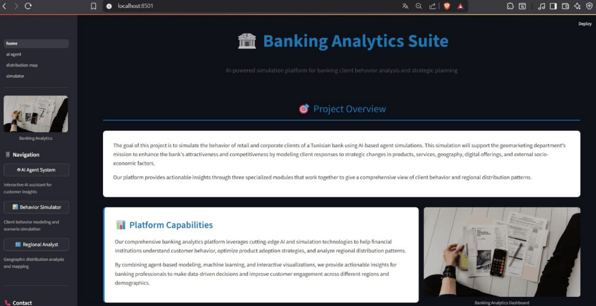
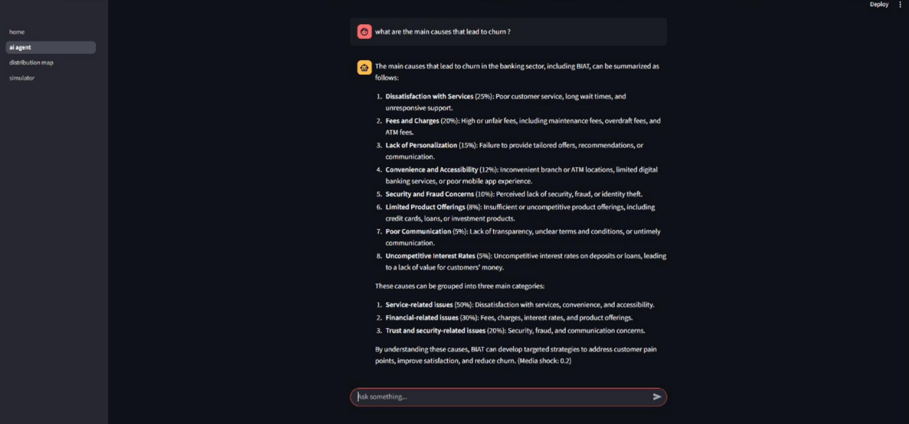
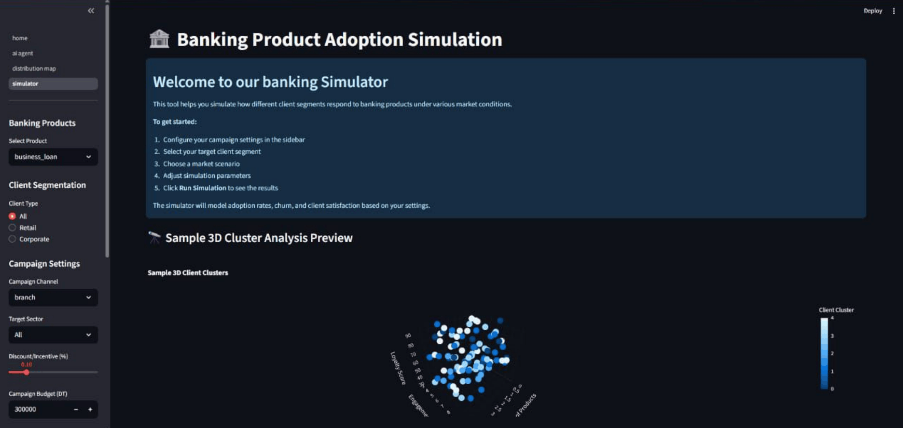
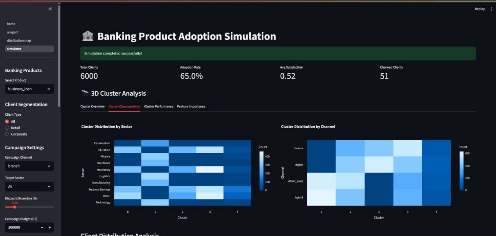
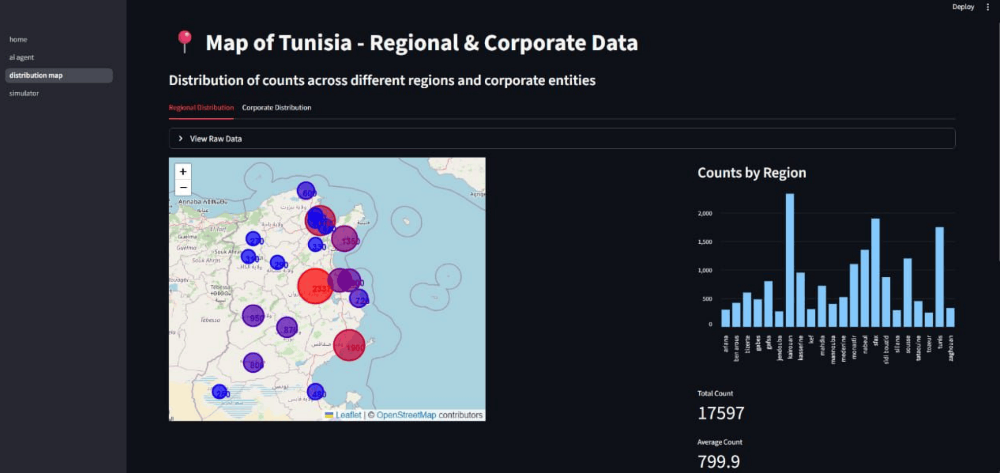
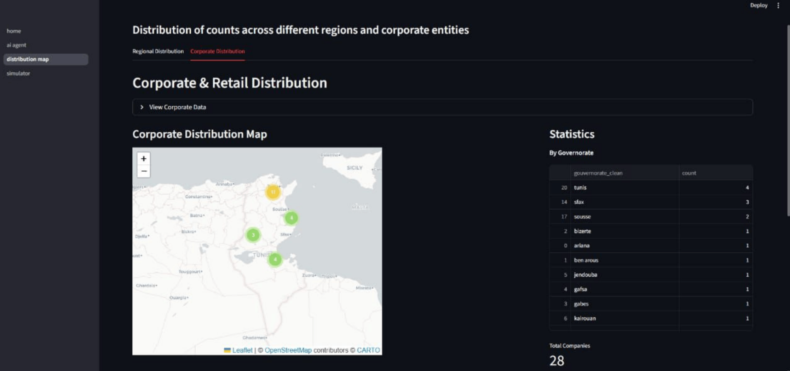

# Simulation of Retail & Corporate Client Behavior — Tunisian Banking Sector

An end-to-end analytics platform that **simulates how retail and corporate bank clients react to products, campaigns and market conditions** in Tunisia. It combines web scraping of the Tunisian banking sector, NLP, client segmentation, an LLM-powered RAG agent and an **agent-based simulation (Mesa)**, all served through an interactive **Streamlit** dashboard.

> Built as an internship project to help banks test marketing strategies *before* launching them: *"If we launch a 10% discount on business loans through digital channels during a currency devaluation, how many clients adopt and how many churn?"*



---

## Table of Contents
- [Key Features](#key-features)
- [Architecture](#architecture)
- [Application Modules](#application-modules)
- [How the Simulation Works](#how-the-simulation-works)
- [Tech Stack](#tech-stack)
- [Project Structure](#project-structure)
- [Installation](#installation)
- [Usage](#usage)
- [Data Pipeline](#data-pipeline)
- [Limitations & Future Work](#limitations--future-work)

---

## Key Features

- **Banking-sector scraper**: Selenium scraper covering **20 Tunisian banks** (STB, BNA, BIAT, Attijari, Amen Bank, Zitouna, UIB, UBCI, …) that collects news and promotional campaigns and summarizes them with an LLM.
- **Client segmentation**: sentence-transformer embeddings of retail and corporate profiles, clustered with **K-Means** and **Spectral Clustering**, then profiled into client **archetypes** (age, salary, sector, region, company size, capital…).
- **RAG banking agent**: a **LangGraph** pipeline (retrieve → generate → memorize → media sentiment) over a **FAISS** knowledge base built from economic reports and scraped data, powered by **Groq (LLaMA 3)**.
- **Scenario analysis agent**: NLP analysis of bank news (sentiment, key phrases, entities) that generates and evaluates market scenarios (new product launch, digital disruption, economic shock, regulatory change, competitor action…) and produces recommendations.
- **Media-shock signal**: the LLM scores Arabic/French media sentiment into a bounded shock value (−0.3 to +0.3) that can feed into the simulation.
- **Agent-based simulation**: a **Mesa** model where each client is an agent with satisfaction, products, preferred channel and sector, reacting to campaigns and market scenarios month by month.
- **Monte Carlo runs**: repeated simulations to estimate mean adoption and satisfaction with confidence ranges.
- **Interactive dashboards**: 3D cluster visualisations, KPI tracking, and a regional map of Tunisia.

---

## Architecture

```
            ┌────────────────────┐        ┌──────────────────────┐
            │  Bank websites (20)│        │ Economic reports     │
            │  news + campaigns  │        │ (PDF)                │
            └─────────┬──────────┘        └──────────┬───────────┘
                      │ Selenium + LLM summary       │ PyPDF + chunking
                      ▼                              ▼
            ┌────────────────────┐        ┌──────────────────────┐
            │  Azure Cosmos DB   │───────▶│ FAISS knowledge base │
            └─────────┬──────────┘        └──────────┬───────────┘
                      │                              │
       ┌──────────────┼───────────────┐              │
       ▼              ▼               ▼              ▼
 ┌───────────┐ ┌─────────────┐ ┌──────────────┐ ┌───────────────────┐
 │Embeddings │ │  Scenario   │ │   Regional   │ │  RAG agent        │
 │+Clustering│ │  agent (NLP │ │ distribution │ │  (LangGraph+Groq) │
 │→Archetypes│ │  + LLM)     │ │              │ │  + media shock    │
 └─────┬─────┘ └──────┬──────┘ └──────┬───────┘ └─────────┬─────────┘
       │              │               │                   │
       ▼              ▼               ▼                   ▼
 ┌──────────────────────────────────────────────────────────────────┐
 │        Mesa agent-based simulation  ·  Streamlit dashboard       │
 └──────────────────────────────────────────────────────────────────┘
```

---

## Application Modules

### 1. AI Agent System — `pages/ai_agent.py`
Conversational assistant for banking insights. Answers questions with retrieval-augmented generation over the knowledge base, runs the full scenario analysis on demand, and returns a media-shock score for the query.



### 2. Behavior Simulator — `pages/simulator.py`
Configure a campaign and run the simulation:

| Parameter | Options |
|---|---|
| Product | business loan, credit line, insurance, savings account |
| Client type | All / Retail / Corporate |
| Campaign channel | branch, digital, hybrid, direct sales |
| Target sector | Retail, Hospitality, Manufacturing, Technology, Finance, … |
| Discount / incentive | 0 – 50 % |
| Campaign budget | in Tunisian Dinars (DT) |
| Market scenario | baseline, currency devaluation, digital transformation, export boom, regional instability, economic growth, recession |
| Horizon / population | 3–36 months, 100–2000 clients, retail/corporate ratio |

Outputs: adoption and churn curves, average satisfaction, **3D cluster analysis**, cluster characteristics and performance, and feature importance.

**Campaign configuration and 3D cluster preview**



**Simulation results: KPIs (total clients, adoption rate, satisfaction, churn) and cluster distribution by sector and channel**



### 3. Regional Analyst — `pages/distribution_map.py`
Interactive **Folium** map of Tunisia's 22 regional directorates with client counts, marker clusters and statistics, plus a corporate vs. retail distribution by governorate.

**Regional distribution: map and counts per region**



**Corporate distribution by governorate**



---

## How the Simulation Works

Each `ClientAgent` (see [`model.py`](model.py)) has a **satisfaction** level, a number of **products**, a preferred **channel**, a **sector** and a **retail/corporate** type. At every step (one month):

1. Satisfaction drifts randomly: `s ← clip(s + N(0, 0.05))`
2. The client may acquire a new product (8% chance).
3. **Adoption probability** of the campaign:

   ```
   p_adopt = 0.04                          # base rate
           + 0.10 × discount               # promotion effect
           + 0.05 if channel matches       # channel fit
           ± 0.04 / −0.02 sector fit       # targeting
           + 0.04 × (satisfaction − 0.5)   # satisfaction push
           + scenario adoption bonus
   ```

4. **Churn probability**: `0.015 + scenario churn bonus − 0.01 if the client adopted`

Market scenarios shift these probabilities, for example *recession* (−4% adoption, +5% churn) or *digital transformation* (+4% adoption, −1% churn). The `DataCollector` records active clients, cumulative adoptions and churn, adoption rate and average satisfaction at every step.

`run.py` wraps the model in a **Monte Carlo** loop (50 runs × 24 months) to report mean ± standard deviation.

---

## Tech Stack

| Area | Tools |
|---|---|
| Frontend | Streamlit, Plotly, Folium |
| Simulation | Mesa (agent-based modeling), NumPy |
| LLM & RAG | Groq (LLaMA 3), LangChain, LangGraph, FAISS |
| NLP | Sentence-Transformers, NLTK (VADER), spaCy, TextBlob, Sumy |
| ML | scikit-learn (K-Means, Spectral Clustering, PCA), UMAP |
| Data collection | Selenium, BeautifulSoup, Requests |
| Storage | Azure Cosmos DB, JSON / CSV, Pickle |

---

## Project Structure

```
.
├── home.py                     # Streamlit entry point (landing page)
├── pages/
│   ├── ai_agent.py             # Chat with the banking agent
│   ├── simulator.py            # Campaign simulation dashboard
│   └── distribution_map.py     # Regional map of Tunisia
│
├── model.py                    # Mesa model: ClientAgent + BankClientModel
├── run.py                      # Monte Carlo simulation runner
├── server.py                   # Mesa native visualization server (port 8521)
│
├── behavioral.py               # RAG + LangGraph agent, memory, media sentiment
├── banking_agent.py            # Scenario generation / evaluation agent (NLP + LLM)
├── run_scenario_agent.py       # Runs the scenario agent end to end
├── integrate_agent.py          # Bridge between the agents and the UI
│
├── scraper.py                  # Selenium scraper for bank websites
├── banks.py                    # List of the 20 Tunisian banks + campaign URLs
├── main.py                     # Scraping pipeline → JSON/CSV + Cosmos DB
├── cosmos_client.py            # Azure Cosmos DB client
├── cosmos_config.py            # Cosmos DB configuration from .env
│
├── kb.py                       # Builds the FAISS knowledge base (PDFs + Cosmos DB)
├── rebuild_faiss.py            # Rebuilds the index with HuggingFace embeddings
├── load.py                     # Loads a saved FAISS index
├── kb_faiss/                   # Saved FAISS index
│
├── retail_embedings/           # Retail data loading, encoding and UMAP visualization
├── corporate_embedings/        # Corporate data loading, encoding and UMAP visualization
├── clustering.py               # K-Means clustering + PCA plots
├── knn.py                      # Spectral (KNN-graph) clustering
├── profiling.py                # Cluster profiling (numeric + categorical)
├── archetype.py                # Converts cluster profiles into client archetypes
│
├── retail_cleaned.json         # Retail cluster profiles
├── corporate.json              # Corporate cluster profiles
├── retail_arch.json / corp_arch.json   # Client archetypes
├── scenario_analysis_results.json      # Sample output of the scenario agent
├── simulation_*.csv            # Sample simulation outputs
│
├── pdfs/pdf.py                 # Downloads economic reports used by the KB
├── requirements.txt
└── .env.example
```

---

## Installation

**Requirements:** Python 3.10+ and, for scraping only, Google Chrome with a matching ChromeDriver.

```bash
git clone https://github.com/nournajjjar/tunisian-bank-client-behavior-simulation.git
cd tunisian-bank-client-behavior-simulation

python -m venv venv
# Windows
venv\Scripts\activate
# macOS / Linux
source venv/bin/activate

pip install -r requirements.txt
```

Create your environment file:

```bash
cp .env.example .env
```

Then fill in your **Groq API key** (free at [console.groq.com](https://console.groq.com)) and, optionally, your Azure Cosmos DB credentials.

---

## Usage

### Launch the dashboard
```bash
streamlit run home.py
```
Open http://localhost:8501 and navigate between the three modules.

### Run a Monte Carlo simulation (CLI)
```bash
python run.py
```
```
Monte Carlo Results
Mean adoption rate: 0.xxx ± 0.xxx
Mean satisfaction : 0.xxx ± 0.xxx
```

### Mesa grid visualization
```bash
python server.py        # http://localhost:8521
```
Agents are colored green (adopted), red (not adopted) or gray (churned).

### Chat with the agent in the terminal
```bash
python behavioral.py          # RAG chat (commands: buildkb, mem, clear)
python run_scenario_agent.py  # full scenario analysis + interactive Q&A
```

---

## Data Pipeline

1. **Scrape**: `python main.py` collects news and campaigns from the 20 banks, then saves them to JSON/CSV and Cosmos DB.
2. **Collect reports**: `python pdfs/pdf.py` downloads the economic and market reports into `pdfs/`.
3. **Build the knowledge base**: `python kb.py` (or `python rebuild_faiss.py`) chunks the documents and indexes them in FAISS.
4. **Segment clients**: `retail_embedings/encodage.py` and `corporate_embedings/encodage.py` generate embeddings, then `clustering.py` / `knn.py` cluster them and `profiling.py` / `archetype.py` produce the profiles and archetypes.
5. **Simulate**: the archetypes and scenarios feed the Mesa model and the Streamlit dashboard.

> The large retail embeddings file (`retail_embeddings.pkl`, ~77 MB) and the PDF reports are not versioned. Regenerate them with steps 2 and 4.

---

## Limitations & Future Work

- Behavioral coefficients are hand-calibrated. They could be fitted on real historical campaign data.
- Plug the media-shock signal directly into the agents' adoption and churn probabilities at each step.
- Add reinforcement learning to optimize campaign parameters (channel, discount, target) automatically.
- Upgrade to Mesa 3.x and containerize the app with Docker.

---

## Author

**Nour El Houda Najjar**  
GitHub: [@nournajjjar](https://github.com/nournajjjar)
